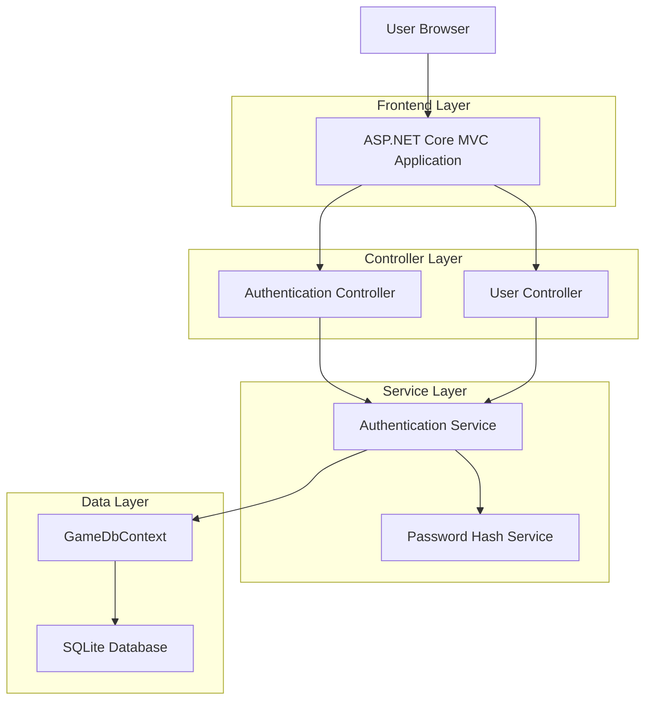
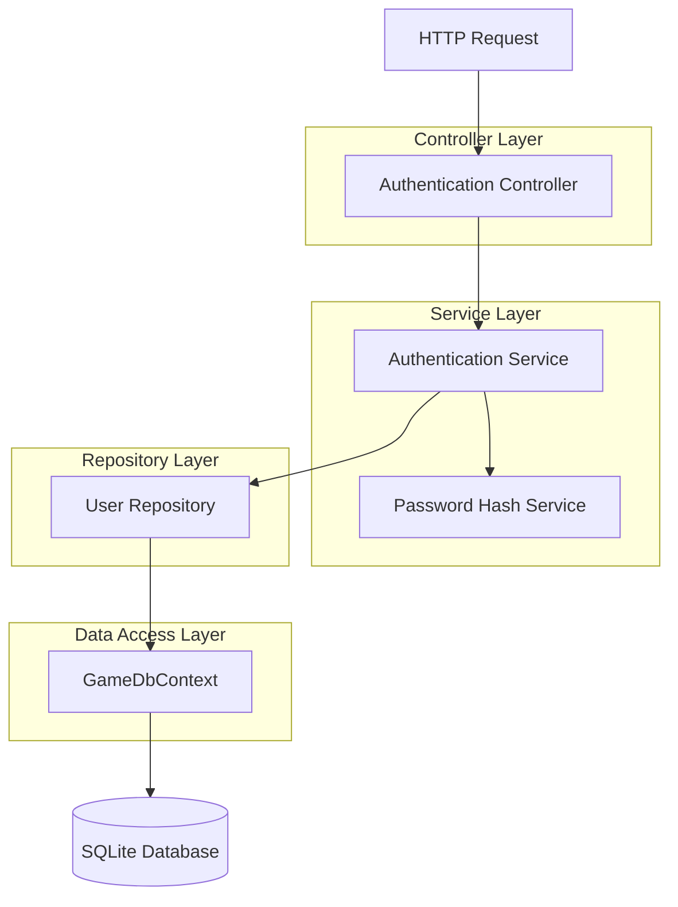
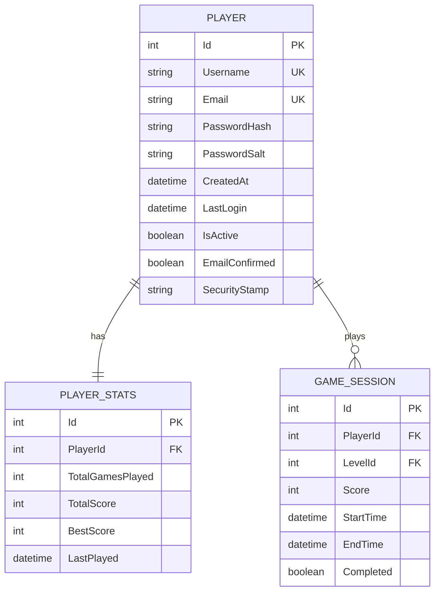

## 1. Architecture design



## 2. Technology Description

* Frontend: ASP.NET Core MVC + Razor Views + Bootstrap 5

* Backend: ASP.NET Core 8.0 + Entity Framework Core

* Database: SQLite (já configurado)

* Authentication: ASP.NET Core Identity (customizado)

## 3. Route definitions

| Route                      | Purpose                                        |
| -------------------------- | ---------------------------------------------- |
| /Account/Register          | Página de registro de novos usuários           |
| /Account/Login             | Página de login de usuários                    |
| /Account/Logout            | Endpoint para logout (POST)                    |
| /Account/Profile           | Página de perfil do usuário autenticado        |
| /Account/EditProfile       | Página para editar dados do perfil             |
| /api/Account/CheckUsername | API para verificar disponibilidade de username |
| /api/Account/CheckEmail    | API para verificar disponibilidade de email    |

## 4. API definitions

### 4.1 Core API

Registro de usuário

```
POST /Account/Register
```

Request:

| Param Name      | Param Type | isRequired | Description                             |
| --------------- | ---------- | ---------- | --------------------------------------- |
| Username        | string     | true       | Nome de usuário único (3-50 caracteres) |
| Email           | string     | true       | Email válido e único                    |
| Password        | string     | true       | Senha (mínimo 6 caracteres)             |
| ConfirmPassword | string     | true       | Confirmação da senha                    |

Response:

| Param Name  | Param Type | Description                 |
| ----------- | ---------- | --------------------------- |
| Success     | boolean    | Status do registro          |
| Message     | string     | Mensagem de sucesso ou erro |
| RedirectUrl | string     | URL para redirecionamento   |

Login de usuário

```
POST /Account/Login
```

Request:

| Param Name      | Param Type | isRequired | Description                  |
| --------------- | ---------- | ---------- | ---------------------------- |
| EmailOrUsername | string     | true       | Email ou username do usuário |
| Password        | string     | true       | Senha do usuário             |
| RememberMe      | boolean    | false      | Manter login ativo           |

Response:

| Param Name  | Param Type | Description                   |
| ----------- | ---------- | ----------------------------- |
| Success     | boolean    | Status do login               |
| Message     | string     | Mensagem de erro se aplicável |
| RedirectUrl | string     | URL para redirecionamento     |

Verificação de disponibilidade

```
GET /api/Account/CheckUsername/{username}
```

Response:

| Param Name | Param Type | Description                   |
| ---------- | ---------- | ----------------------------- |
| Available  | boolean    | Se o username está disponível |

```
GET /api/Account/CheckEmail/{email}
```

Response:

| Param Name | Param Type | Description                |
| ---------- | ---------- | -------------------------- |
| Available  | boolean    | Se o email está disponível |

## 5. Server architecture diagram



## 6. Data model

### 6.1 Data model definition



### 6.2 Data Definition Language

Extensão da tabela Player (Migration)

```sql
-- Adicionar colunas de autenticação à tabela Players existente
ALTER TABLE Players ADD COLUMN PasswordHash VARCHAR(255) NOT NULL DEFAULT '';
ALTER TABLE Players ADD COLUMN PasswordSalt VARCHAR(255) NOT NULL DEFAULT '';
ALTER TABLE Players ADD COLUMN EmailConfirmed BOOLEAN NOT NULL DEFAULT 0;
ALTER TABLE Players ADD COLUMN SecurityStamp VARCHAR(255) NOT NULL DEFAULT '';
ALTER TABLE Players ADD COLUMN FailedLoginAttempts INTEGER NOT NULL DEFAULT 0;
ALTER TABLE Players ADD COLUMN LockoutEnd DATETIME NULL;

-- Criar índices para performance
CREATE INDEX idx_players_email ON Players(Email);
CREATE INDEX idx_players_username ON Players(Username);
CREATE INDEX idx_players_security_stamp ON Players(SecurityStamp);

-- Dados iniciais para desenvolvimento (opcional)
INSERT INTO Players (Username, Email, PasswordHash, PasswordSalt, EmailConfirmed, CreatedAt, IsActive, SecurityStamp)
VALUES 
('admin', 'admin@jogabolinha.com', '[HASH_GERADO]', '[SALT_GERADO]', 1, datetime('now'), 1, '[SECURITY_STAMP]'),
('testuser', 'test@example.com', '[HASH_GERADO]', '[SALT_GERADO]', 1, datetime('now'), 1, '[SECURITY_STAMP]');
```

Tabela de Sessões (opcional para controle avançado)

```sql
-- Criar tabela para controle de sessões ativas
CREATE TABLE UserSessions (
    Id INTEGER PRIMARY KEY AUTOINCREMENT,
    PlayerId INTEGER NOT NULL,
    SessionToken VARCHAR(255) NOT NULL,
    CreatedAt DATETIME NOT NULL DEFAULT CURRENT_TIMESTAMP,
    ExpiresAt DATETIME NOT NULL,
    IsActive BOOLEAN NOT NULL DEFAULT 1,
    IpAddress VARCHAR(45),
    UserAgent TEXT,
    FOREIGN KEY (PlayerId) REFERENCES Players(Id) ON DELETE CASCADE
);

-- Índices para a tabela de sessões
CREATE INDEX idx_user_sessions_player_id ON UserSessions(PlayerId);
CREATE INDEX idx_user_sessions_token ON UserSessions(SessionToken);
CREATE INDEX idx_user_sessions_expires ON UserSessions(ExpiresAt);
```

