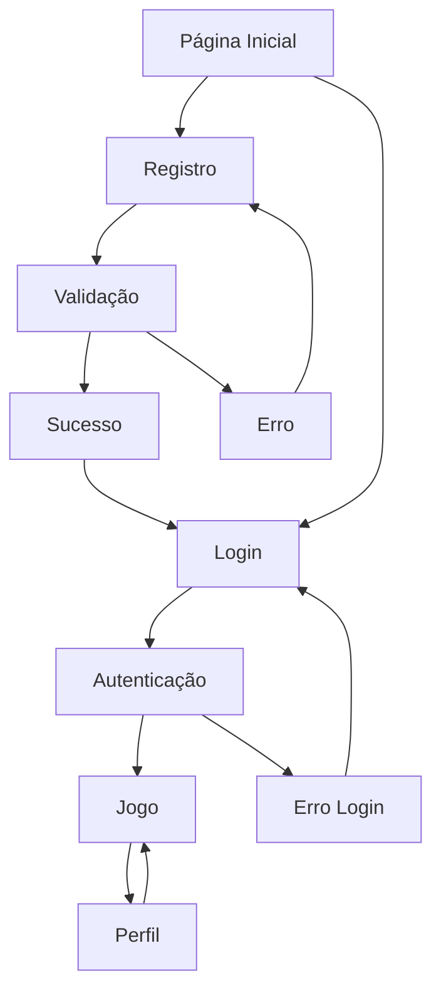

## 1. Product Overview
Sistema de autenticação de usuários para o jogo JogoBolinha, permitindo registro, login e gerenciamento de sessões de usuário.
- Extensão do modelo Player existente para suportar autenticação segura com hash de senhas
- Interface web para registro e login de usuários com validação de dados

## 2. Core Features

### 2.1 User Roles
| Role | Registration Method | Core Permissions |
|------|---------------------|------------------|
| Jogador Anônimo | Não requer registro | Pode jogar sem salvar progresso |
| Jogador Registrado | Email e senha | Pode salvar progresso, ver estatísticas e rankings |

### 2.2 Feature Module
Nosso sistema de autenticação consiste nas seguintes páginas principais:
1. **Página de Registro**: formulário de cadastro, validação de dados, confirmação de registro
2. **Página de Login**: formulário de login, validação de credenciais, redirecionamento
3. **Página de Perfil**: visualização de dados do usuário, edição de informações, estatísticas do jogo

### 2.3 Page Details
| Page Name | Module Name | Feature description |
|-----------|-------------|---------------------|
| Página de Registro | Formulário de Cadastro | Capturar username, email e senha com validação em tempo real |
| Página de Registro | Validação de Dados | Verificar unicidade de username/email, força da senha, formato do email |
| Página de Registro | Confirmação | Exibir mensagem de sucesso e redirecionar para login |
| Página de Login | Formulário de Login | Capturar email/username e senha com validação |
| Página de Login | Autenticação | Verificar credenciais, criar sessão, redirecionar para jogo |
| Página de Login | Recuperação de Senha | Link para reset de senha (funcionalidade futura) |
| Página de Perfil | Dados do Usuário | Exibir informações pessoais editáveis |
| Página de Perfil | Estatísticas | Mostrar progresso no jogo, conquistas e ranking |
| Página de Perfil | Gerenciamento | Alterar senha, desativar conta |

## 3. Core Process
**Fluxo de Registro de Usuário:**
1. Usuário acessa página de registro
2. Preenche formulário com username, email e senha
3. Sistema valida dados em tempo real
4. Após submissão, sistema verifica unicidade de username/email
5. Senha é hasheada com salt e armazenada no banco
6. Usuário é redirecionado para página de login com mensagem de sucesso

**Fluxo de Login de Usuário:**
1. Usuário acessa página de login
2. Insere email/username e senha
3. Sistema verifica credenciais contra banco de dados
4. Se válidas, cria sessão de autenticação
5. Usuário é redirecionado para página principal do jogo
6. Se inválidas, exibe mensagem de erro

## 4. User Interface Design
### 4.1 Design Style
- **Cores primárias**: #2563eb (azul), #dc2626 (vermelho para erros)
- **Cores secundárias**: #f8fafc (fundo), #64748b (texto secundário)
- **Estilo de botões**: Arredondados com hover effects, sombra sutil
- **Fonte**: Inter ou system fonts, tamanhos 14px-16px para texto, 24px-32px para títulos
- **Layout**: Cards centralizados com formulários limpos, navegação superior
- **Ícones**: Lucide icons ou similar, estilo minimalista

### 4.2 Page Design Overview
| Page Name | Module Name | UI Elements |
|-----------|-------------|-------------|
| Página de Registro | Formulário de Cadastro | Card centralizado, campos com labels flutuantes, botão azul primário, validação em tempo real com ícones |
| Página de Login | Formulário de Login | Layout similar ao registro, checkbox "Lembrar-me", link "Esqueci minha senha" |
| Página de Perfil | Dados do Usuário | Layout em duas colunas, avatar do usuário, cards para diferentes seções |

### 4.3 Responsiveness
Design mobile-first com breakpoints para tablet (768px) e desktop (1024px). Formulários se adaptam para telas menores com campos empilhados verticalmente.